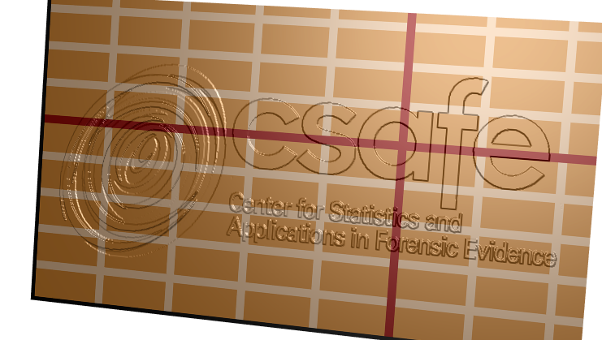
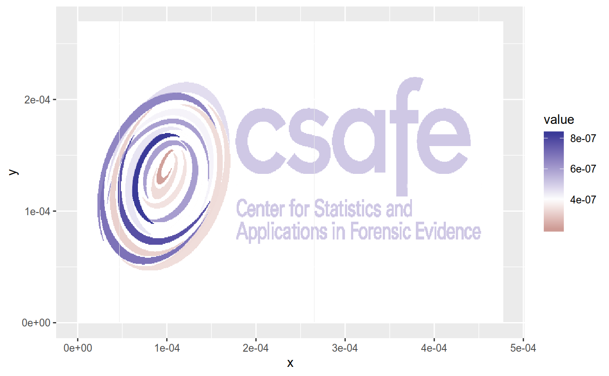
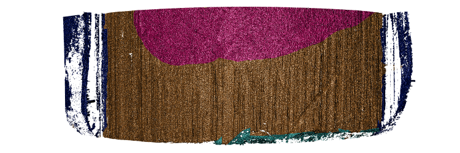

[](https://CRAN.R-project.org/package=x3ptools)

[](https://r-pkg.org/pkg/x3ptools)
[](https://lifecycle.r-lib.org/articles/stages.html#stable)
[](https://github.com/heike/x3ptools/commits/main)
[](https://app.codecov.io/gh/heike/x3ptools)
[](https://github.com/heike/x3ptools/actions)

# x3ptools 

The x3p file format is specified in ISO standard 25178-72:2017/AMD
1:2020 (based on ISO ISO5436 – 2000) describe 3d surface measurements.
This package allows reading, writing and basic modifications to the 3D
surface measurements.

# Installation

`x3ptools` is available from CRAN:

``` r
install.packages("x3ptools")
```

The development version is available from Github:

``` r
# install.packages("devtools")
devtools::install_github("heike/x3ptools", build_vignettes = TRUE)
```

## The file format

The x3p file format is an xml based file format created to describe
digital surface measurements. x3p has been developed by OpenFMC (Open
Forensic Metrology Consortium, see <https://www.open-fmc.org/>) and has
been adopted as 25178-72:2017/AMD 1:2020. x3p files are a zip archive of
a directory consisting of an xml file of meta information and a matrix
of numeric surface measurements.

### x3p objects

Internally, x3p objects are stored as a list consisting of the surface
matrix (the measurements) and meta information in four records: header
info, feature info, general info, and matrix info:

``` r
library(x3ptools)
logo <- x3p_read(system.file("csafe-logo.x3p", package="x3ptools"))
names(logo)
```

    ## [1] "header.info"    "surface.matrix" "feature.info"   "general.info"  
    ## [5] "matrix.info"

The four info objects specify the information for Record1 through
Record4 in the xml file. An example for an xml file is provided with the
package and can be accessed as
`system.file("templateXML.xml", package="x3ptools")`.

`header.info` contains the information relevant to interpret locations
for the surface matrix:

``` r
logo$header.info
```

    ## $sizeY
    ## [1] 419
    ## 
    ## $sizeX
    ## [1] 741
    ## 
    ## $incrementY
    ## [1] 6.45e-07
    ## 
    ## $incrementX
    ## [1] 6.45e-07

`matrix.info` expands on `header.info` and provides the link to the
surface measurements in binary format.

`general.info` consists of information on how the data was captured,
i.e. both author and capturing device are specified here.

`feature.info` is informed by the header info and provides the structure
for storing the information.

While these pieces can be changed and adapted manually, it is more
convenient to save information on the capturing device and the creator
in a separate template and bind measurements and meta information
together in the command `x3p_addtemplate`.

### Reading and writing x3p files

`x3p_read` and `x3p_write` are the two functions allows us to read x3p
files and write to x3p files.

``` r
logo <- x3p_read(system.file("csafe-logo.x3p", package="x3ptools"))
names(logo)
```

    ## [1] "header.info"    "surface.matrix" "feature.info"   "general.info"  
    ## [5] "matrix.info"

## Usage

### Visualizing x3p objects

The function `x3p_image` uses `rgl` to render a 3d object in a separate
window. The user can then interact with the 3d surface (zoom and
rotate):

``` r
x3p_image(logo, size=c(741,419), zoom=0.5, useNULL=TRUE)
rgl::rglwidget()
```


In case a file name is specified in the function call the resulting
surface is saved in a file (the extension determines the actual file
format of the image).

#### Helper lines

`x3p_image_grid` lays a regularly spaced grid of lines over the surface
of the scan. Lines are drawn `spaces` apart (50 microns by default in y
direction and 100 microns in x direction). Every fifth and tenth lines
are colored differently to ease a visual assessment of distance.

``` r
logoplus <- x3p_add_grid(logo, spaces=50e-6, 
                         size = c(3,3,5), color=c("grey50", "black", "darkred"))
x3p_image(logoplus, size=c(741,419), zoom=0.5, useNULL=TRUE)
rgl::rglwidget()
```



### Casting between data types

The functions `x3p_to_df` and `df_to_x3p` allow casting between an x3p
format and an x-y-z data set:

``` r
logo_df <- x3p_to_df(logo)
head(logo_df)
```

    ##           x          y value
    ## 1 0.000e+00 0.00026961 4e-07
    ## 2 6.450e-07 0.00026961 4e-07
    ## 3 1.290e-06 0.00026961 4e-07
    ## 4 1.935e-06 0.00026961 4e-07
    ## 5 2.580e-06 0.00026961 4e-07
    ## 6 3.225e-06 0.00026961 4e-07

When converting from the x3p format to a data frame, the values from the
surface matrix are interpreted as heights (saved as `value`) on an x-y
grid. The dimension of the matrix sets the number of different x and y
levels, the information in `header.info` allows us to scale the levels
to the measured quantities. Similarly, when moving from a data frame to
a surface matrix, the assumption is that measurements are taken on an
equi-spaced and complete grid of x-y values. The information on the
resolution (i.e. the spacing between consecutive x and y locations) is
saved in form of the header info, which is added to the list. General
info and feature info can not be extracted from the measurements, but
have to be recorded with other means.

Once data is in a regular data frame, we can use our regular means to
visualize these raster images, e.g. using `ggplot2`:

``` r
library(ggplot2)
library(magrittr)

logo_df %>% ggplot(aes( x= x, y=y, fill= value)) +
  geom_tile() +
  scale_fill_gradient2(midpoint=4e-7)
```

<!-- -->

### Elementary operations

#### Rotation and Transposition

`x3p_rotate` rotates an x3p image counter-clockwise by angle in degrees,
`x3p_transpose` transposes the surface matrix of an image and updates
the corresponding meta information. The function `x3p_flip_y` is a
combination of transpose and rotation, that allows to flip the direction
of the y axis to move easily from legacy ISO x3p scans to ones
conforming to the most recent ISO standard.

#### Sampling

`x3p_sample` allows to sub-sample an x3p object to get a lower
resolution image. In `x3p_sample` we need to set a sampling factor. A
sample factor `mX` of 2 means that we only use every 2nd value of the
surface matrix, `mX` of 5 means, we only use every fifth value:

``` r
dim(logo$surface.matrix)
```

    ## [1] 741 419

``` r
logo_sample <- x3p_sample(logo, m=5)
dim(logo_sample$surface.matrix)
```

    ## [1] 149  84

Parameter `mY` can be specified separately from `mX` for a different
sampling rate in y direction. We can also use different offsets in x and
y direction by specifying `offsetX` and/or `offsetY`.

``` r
sample2 <- x3p_sample(logo, m=5, offset=1)
cor(as.vector(logo_sample$surface.matrix[-149,]), as.vector(sample2$surface.matrix))
```

    ## [1] 0.8639308

#### Interpolation

`x3p_interpolate` allows, like `x3p_sample`, to create a new x3p file at
a new resolution, as specified in the parameters `resx` and `resy`. The
new resolution should be lower (i.e. larger values for `resx` and
`resy`) than the resolution specified as `IncrementX` and `IncrementY`
in the header info of the x3p file. `x3p_interpolate` can also be used
to interpolate missing values (set parameter `maxgap` according to
specifications in `zoo::na.approx`).

### Inspecting and modifying meta information

The four records of header info, feature info, general info, and matrix
info of an x3p object contain meta information relevant to the scan.
`x3p_show_xml` allows the user to specify a search term and then
proceeds to go through all records for a matching term. As a result any
matching elements from the meta file are shown:

``` r
logo %>% x3p_show_xml("axis") # three axes are defined
```

    ## $Axes.CX.AxisType
    ## [1] "I"
    ## 
    ## $Axes.CY.AxisType
    ## [1] "I"
    ## 
    ## $Axes.CZ.AxisType
    ## [1] "A"

``` r
logo %>% x3p_show_xml("creator")
```

    ## $Creator
    ## [1] "Heike Hofmann, CSAFE"

If a search term identifies a single element, `x3p_modify_xml` allows
the user to update the corresponding meta information:

``` r
logo %>% x3p_modify_xml("creator", "I did this")
```

    ## x3p object
    ## Instrument: N/A 
    ## size (width x height): 741 x 419 in pixel 
    ## resolution: 6.4500e-07 x 6.4500e-07 
    ## Creator: I did this 
    ## Comment: image rendered from the CSAFE logo

### Adding and modifying masks

#### Images as masks

A mask is used to markup regions of the surface - the mask can then be
used to overlay the rendered surface with color.

Below is a 3d surface of a part of a bullet surface is shown. Some
regions are marked up: the bronze colored area is an area with strong
striae (vertical lines engraved on the bullet as it moves through the
barrel of the handgun when fired), areas in dark blue show groove
engraved areas, the light blue area shows break off at the bottom of the
bullet, and the pink area marks an area without striae:



Any image can serve as a mask, the command `x3p_add_mask` allows to add
a raster image as a mask for a x3p object:

``` r
logo <- x3p_read(system.file("csafe-logo.x3p", package="x3ptools"))
color_logo <- png::readPNG(system.file("csafe-color.png", package="x3ptools"))
logoplus <- x3p_add_mask(logo, mask = as.raster(color_logo))

x3p_image(logoplus, size=c(741, 419), zoom=0.5, multiply = 30)
```


Some masks are more informative than others, but the only requirement
for images is that they are of the right size.


#### Editing masks

Masks are raster images. Any change to the raster manifests as a change
in the surface color of the corresponding scan. We suggest using the
`magick` package to manipulate masks.

Additionally, vertical and horizontal lines can be added in the masks
using the commands `x3p_add_vline` and `x3p_add_hline`:

``` r
logo <- x3p_read(system.file("csafe-logo.x3p", package="x3ptools"))
logoplus <- x3p_add_hline(logo, yintercept=c(13e-5,19.5e-5), color="cyan")

x3p_image(logoplus, size=c(741, 419)/2, zoom=0.5, multiply = 30, file="man/figures/logo-lines.png")
```


